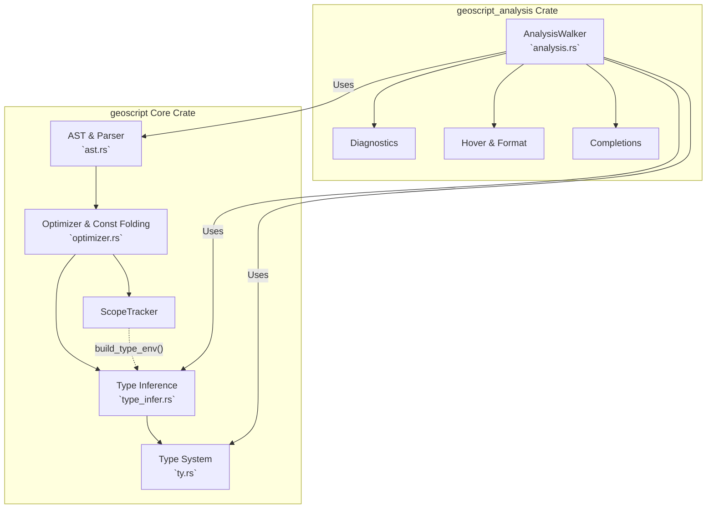

# Geoscript Abstract Interpretation & Optimizer Architecture Review

## High-Level Architecture

Following the Layer 5b unification, the boundary between the `geoscript` core crate and the `geoscript_analysis` editor crate has shifted significantly. The core crate now owns the fundamental abstract interpretation machinery—previously built just for editor tooling—enabling the optimizer to leverage rich type data (unions, closures, partial applications).

### Crate Boundaries & Interactions

### Key Components

1. **`geoscript::ty::AbstractType`**: The single source of truth for the type system. It supports concrete types (`ArgType`), unions, callables (closures), and partial applications.
2. **`geoscript::type_infer::infer_expr`**: The forward type inference engine. Originally created for the editor, it's now a core primitive.
3. **`geoscript::optimizer::optimize_expr`**: The const-folding and partial evaluation pass. It utilizes a `ScopeTracker` to track both evaluated constant values (`TrackedValue::Const`) and dynamic values (`TrackedValue::Dyn`). For dynamic values, it queries `infer_expr` to retain rich type information instead of using hacky dummy values.
4. **`geoscript_analysis::analysis::AnalysisWalker`**: The single-pass editor analysis walker. It traverses the AST to build the semantic model required for hovers, go-to definition, completions, and diagnostics.

---

## Evaluation of the Integration

The migration of `AbstractType` and `infer_expr` into the `geoscript` crate is a major architectural win. It successfully eliminates the "dual type system" problem where the optimizer was guessing types using `build_example_val` while the analysis crate was doing proper abstract interpretation.

**Strengths:**
* **Single Source of Truth:** `infer_expr` correctly handles all complex language features (partial applications, pipeline operators, closures) and provides that identical data back to the optimizer.
* **Simplified Optimizer:** The optimizer no longer has to guess types using dummy values (`pre_resolve_expr_type` is gone).

**Friction Points (Opportunities for Cleanup):**
* **Dual Scope Representations:** The optimizer uses `ScopeTracker` (a linked list of variable bindings carrying literal `Value`s), while type inference uses `TypeEnv` (a scoped environment stack of `AbstractType`s). Bridging them currently requires an `O(N)` mapping step (`scope_tracker.build_type_env()`) per type-check query.
* **Vestigial Optimizer Mechanisms:** Mechanisms like `DynType` and `TrackedValue::Arg` were originally designed to track whether expressions depend on closure arguments vs. "true" dynamic values. As abstract interpretation has improved, these classifications have become largely redundant. They create duplicate logic paths that, in some cases, intentionally discard recoverable type information.
